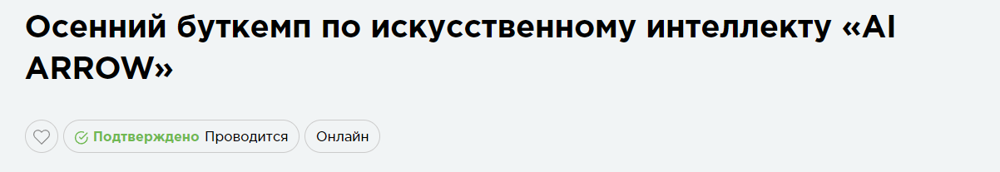

# AI-ARROW Autumn_2024

В данном репозитории размещены материалы и выполненные ДЗ по программе буткемпа - технологии машинного зрения в контексте распознавания и идентификации объектов на фото и видео.

## Описание проектов:
| Номер проекта | Название и ссылка | О чем проект                                                     |
|---------------|-------------------|------------------------------------------------------------------|
|1              |[Введение в Computer Vision](https://github.com/AlexeyK12/AI-ARROW---Autumn_2024/blob/main/Лекция_1.pdf)|Знакомство с CV|
|2              |[Работа с данными и предобработка изображений](https://github.com/AlexeyK12/AI-ARROW---Autumn_2024/blob/main/Лекция_2.pdf) |Основные шаги по подготовке изображений для обучения систем компьютерного зрения|
|3              |[Классические алгоритмы машинного обучения для CV](https://github.com/AlexeyK12/AI-ARROW---Autumn_2024/blob/main/Лекция_3.pdf) |Задачи решаемые CV|
|4              |[Введение в нейронные сети](https://github.com/AlexeyK12/AI-ARROW---Autumn_2024/blob/main/Лекция_4.pdf) |Задачи и методы "Глубокого обучения"|
|5              |[Свёрточные нейронные сети (CNN)](https://github.com/AlexeyK12/AI-ARROW---Autumn_2024/blob/main/Лекция_5.pdf) |Принципы построения свёрточных нейронных сетей|
|6              |[Детекция объектов на изображении](https://github.com/AlexeyK12/AI-ARROW---Autumn_2024/blob/main/Лекция_6.pdf) |Цикл задачи детекции объектов|
|7              |[Сегментация изображений](https://github.com/AlexeyK12/AI-ARROW---Autumn_2024/blob/main/Лекция_7.pdf) |Цикл задачи сегментации объектов|
|7              |[Финальный проект](https://github.com/AlexeyK12/AI-ARROW---Autumn_2024/blob/main/%22ДЗ_1_AI_ARROW_4_tasks_ipynb%22.ipynb) |Реализация моделей CV|
